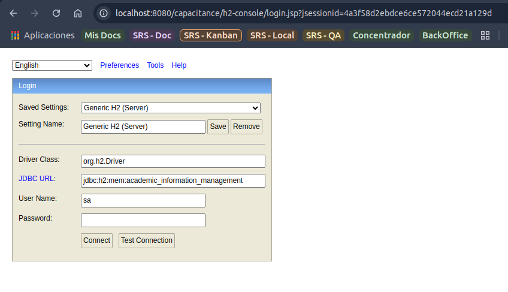
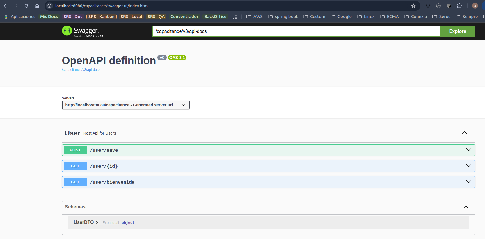
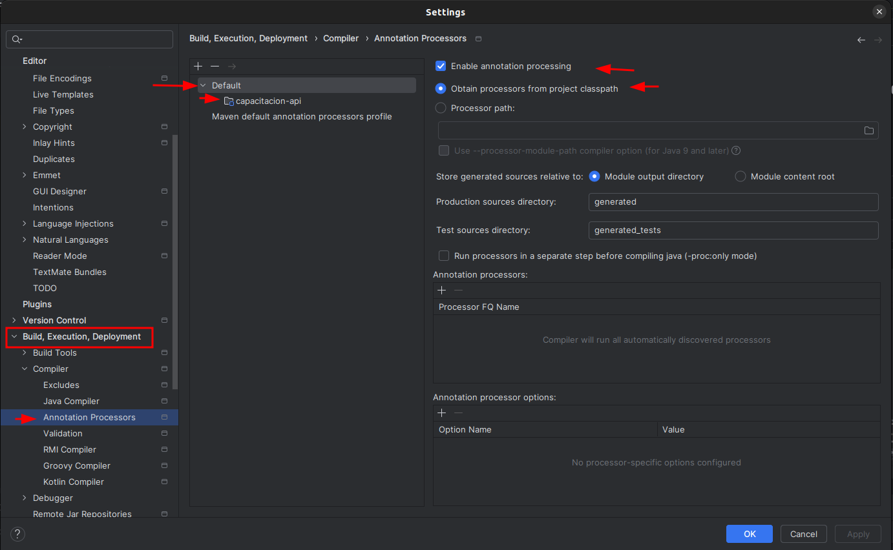

[Indice](../README.md)

# Java Configuraciones

* [Project in GitHub](https://github.com/jhonnnier/backend-capacitacion)
* [Lombok](https://projectlombok.org/)
* [Project generator](https://start.spring.io/)
* [Swagger](http://localhost:8080/capacitance/swagger-ui/index.html)
* [H2 - console](http://localhost:8080/capacitance/h2-console)
* [SDKMan](#section-sdk-man)

| Dependencia                                                   | descripción                           |
|---------------------------------------------------------------|---------------------------------------|
| [spring-boot-starter-aop](https://acortar.link/kBg46w)        | Activa las anotaciones personalizadas |
| [spring-boot-starter-validation](https://acortar.link/PimErT) | Activa los validators personalizados  |
|                                                               |                                       |

* [H2 - console](http://localhost:8080/capacitance/h2-console)
  

* [Swagger](http://localhost:8080/capacitance/swagger-ui/index.html)
  

* Configurar UTF-8
  

* Configurar Lombok
  

### <section id="section-sdk-man">Instalar SDKMan</section>

```
curl -s "https://get.sdkman.io" | bash
source "$HOME/.sdkman/bin/sdkman-init.sh"
sdk version
```

- Instalar JAVA con SDKMan

```
sdk list java
sdk install java 17.0.12-oracle
sdk use 17.0.12-oracle
java -version

sdk list java
sdk install java 11.0.14.1-jbr
sdk use java 11.0.14.1-jbr
java -version

sdk list java
sdk install java 21.0.6-oracle
sdk use java 21.0.6-oracle
java -version

sdk list java
sdk install java 8.0.442-zulu
sdk use java 8.0.442-zulu
java -version
```

## Otros comandos

| Descripción       | Comando                                                                                                                                                                                        |
|-------------------|------------------------------------------------------------------------------------------------------------------------------------------------------------------------------------------------|
| Instalar librería | <pre>mvn install:install-file -Dfile=/home/cx-domains/conexia-suite-jdk/target/suite-api-jdk-exec.jar -DgroupId=com.conexia -DartifactId=suite-api-jdk -Dversion=3.3.5.1 -Dpackaging=jar</pre> |
|                   |                                                                                                                                                                                                |
|                   |                                                                                                                                                                                                |
